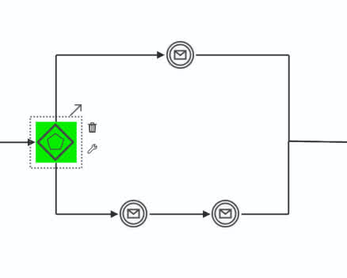
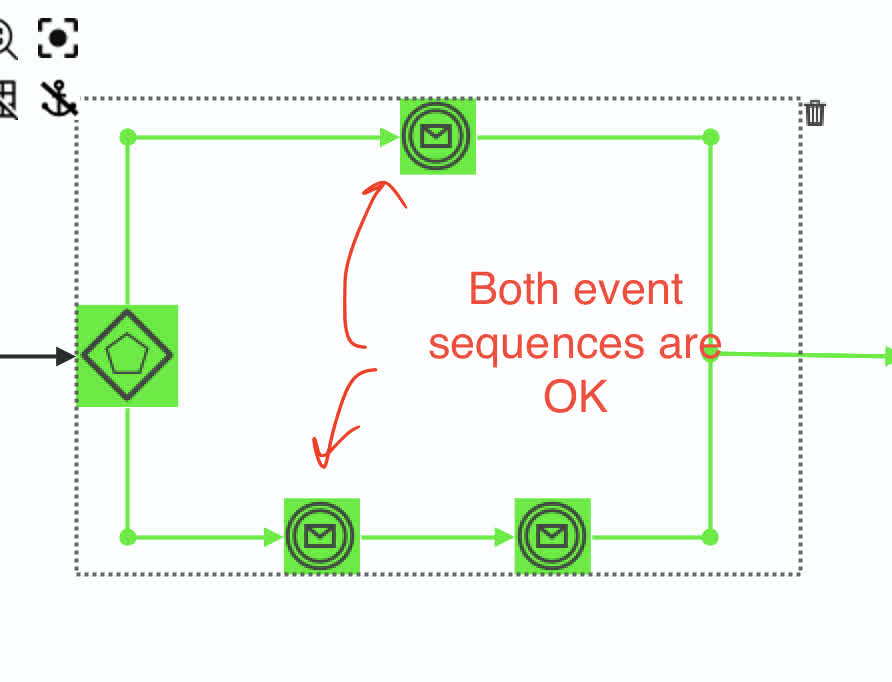

# BPMN crashcourse
The intent of this repository is to bring you up to speed with BPMN

# There is Spring Boot project in this repository
The Maven project here is a simple Spring Boot console app that illustrates how your working day
may look in BPMN notation.

The `BpmnCrashcourseApp` app will deploy BPMN process from [going-to-work.bpmn20.xml](src/main/resources/processes/going-to-work.bpmn20.xml)
as defined by configuration property in `application.yaml`:
```yaml
flowable:
  process-definition-location-prefix: classpath*:/processes/**/
```
Depending on is it working day or weekend the process would take different paths.
If it is working day, the process would expect for you to interact with it.

Visualize the process and play with this demo application to gain basic BPMN understanding.

# Jumping into BPMN
In next sections, we will dive into Business Process Model and Notation (BPMN), 
a standardized way to visually represent business processes. BPMN can be used
not only for business process orchestration but for a technical process orchestration as well
(like complex microservice transaction, complicated ETL or authorization flow, etc.)


# Table Of Contents
1. [How and why do we use BPMN in the projects architecturally](#how-do-we-use-bpmn-in-the-projects-architecturally)
2. [How Do We Start a BPMN Process?](#How-Do-We-Start-a-BPMN-Process)
3. [How Do We Interact with a BPMN Process?](#How-Do-We-Interact-with-a-BPMN-Process)
4. [BPMN structural elements and how we use them](#BPMN-structural-elements-and-how-we-use-them)
    - Call Java code from BPMN - [Service task](#Service-task)
    - [Service task - triggerable](#Service-task---triggerable)
    - Conditional branching - [Exclusive gateway](#Exclusive-gateway)
    - "Parallel" flow - [Parallel gateway](#Parallel-gateway)
    - [Event-based gateway](#Event-based-gateway)
    - Call some other process from current - [Call activity](#Call-activity)
    - Group activities - [Embedded subprocess](#Embedded-subprocess)
    - Define "wait" state - [Message catch event](#Message-catch-event)
    - Require operator/user intervention - [User task](#User-task)
    - [Start event](#Start-event)
    - [Timer start event](#Timer-start-event)
    - [End event](#End-event)
    - [Terminate end event](#Terminate-end-event)
5. [BPMN patterns](#BPMN-patterns)
    - [Polling](#Polling)
    - [Timeout](#Timeout)
    - [Process cancellation on event](#Process-cancellation-on-event)
    - [Handle and register different event sequences that may happen](#Handle-and-register-different-event-sequences-that-may-happen)
6. [Database transactions and BPMN](#Database-transactions-and-BPMN)
7. [BPMN typical pitfalls](#BPMN-typical-pitfalls)
8. [Debugging](#debugging)


# How do we use BPMN in the projects architecturally


BPMN, or **Business Process Model and Notation**, is like a powerful and advanced version of a state machine. It provides a way to model, visualize, and execute business processes step-by-step, much like a flowchart, but with additional features designed for managing complex workflows.

#### Why BPMN is Useful

1. **Executing Business Logic**  
   BPMN allows us to break down complex business processes into clear, manageable steps that can be executed one at a time. Each step can represent tasks, decisions, or events within a process.

2. **Persistent Execution**  
   Unlike flowcharts, BPMN automatically saves (persists) the current state of the process in a database. This means that if the system shuts down or restarts, the process can resume exactly where it left off.

3. **Implementing High-Level Business Logic**  
   BPMN is used to coordinate and implement high-level business workflows. This makes it ideal for processes involving multiple teams, systems, or operations, as it ensures everything flows as designed.

4. **Version Control and Visual Representation**
    - **Version Control**: BPMN manages different versions of a process. For example, if business requirements change, you can update the process while keeping previous versions for reference.
    - **Visual Representation**: BPMN provides diagrams that show how tasks, decisions, and events are interconnected. This makes processes easier to understand, debug, and communicate with both technical and non-technical stakeholders.

5. **Dynamic Updates**  
   One of BPMN’s strongest features is flexibility. If the workflow needs changes, you can update the BPMN diagram, save it in the database, and the system will adapt without requiring complex code rewrites.

#### Why BPMN Matters for Developers

- BPMN bridges the gap between **business stakeholders** (who understand the process requirements) and **developers** (who implement the functionality).
- As a developer, you can focus on implementing specific tasks or steps in the process, while BPMN coordinates the entire workflow for you.

#### Summary

In short, BPMN acts as both a **process orchestrator** and a **visual tool**. It makes business processes easier to implement, manage, and adapt over time. 
It’s a crucial tool for ensuring your application handles workflows efficiently and reliably.


**This is how your daily routine may look like in BPMN**


# How Do We Start a BPMN Process?

In BPMN, starting a process involves triggering the workflow to begin its execution. There are multiple ways to start a BPMN process, depending on the application's requirements. Here's how:

#### 1. **Starting a Process Programmatically in Java**
- You can start a BPMN process directly in your Java code using the `startProcessInstanceByKey` method.
- This is useful when the process needs to be triggered in response to specific actions or API calls in your application. For example:
  ```java
  runtimeService.startProcessInstanceByKey("processKey", variables);
  ```
    - `processKey`: This is the unique identifier of the BPMN process you want to start (Is `Process ID` field in BPMN modellers).
    - `variables`: These are any data inputs you might want to pass to the process at the time of starting.

---

#### 2. **Starting a Process with a Timer Start Event**
- BPMN itself supports starting processes on a predefined schedule using the **Timer Start Event**.
- This is configured directly in the BPMN model. For example:
    - You can set a timer to trigger the process every day at 9:00 AM.
    - Example configuration in a BPMN diagram:
        - **Cycle Timer**: `R/PT24H` (Repeats every 24 hours)
        - **Date Timer**: `2024-12-17T09:00:00` (Triggers at a specific time)
- Once deployed, the process will automatically start at the configured intervals without requiring any Java code.

---

#### Summary

- **Directly in Java Code**: Use `startProcessInstanceByKey` when you want to trigger the process manually or in response to specific events.
- **Using Timer Start Event**: Define a timer in the BPMN diagram to start processes automatically based on time-based conditions.

By understanding these options, you can choose the right approach based on the business logic and operational requirements of your application.


# How Do We Interact with a BPMN Process?

In BPMN, processes often spend time in a **"wait state"**, pausing at certain points and waiting for an external trigger to continue.
Those "wait states" is exactly the place where we want to interact with the process.
**"Wait state"** happens when the process encounters events like user tasks, message events, or timers. Once triggered, the process resumes and continues executing its steps as defined in the BPMN model, performing the associated business logic.

Here’s how you can interact with a BPMN process programmatically:

---

#### 1. **Triggering the Process**
When a BPMN process is in a wait state, you can signal it to continue using the `trigger` or `triggerAsync` or `messageEventReceived` methods.
There are other trigger types i.e. for signals, but we will not cover that here.
**Note:** If you are reading Flowable resources first to get i.e. `executionId` and then triggering the process - 
ensure both operations happen inside single transaction.

##### This is how you notify the process that an external event (outside the BPMN process) has occurred:
```java
runtime.messageEventReceived("aMessageHappened", executionId, variables);
```
##### This is how you trigger process in general (for message or triggerable Service task)
  ```java
  runtimeService.trigger(executionId, variables, transientVariables);
  ```
    - `executionId`: The unique ID of the process execution current step.
    - `variables`: Data you pass into the process when triggering it. These can be:
        - **Persistent Variables**: Available throughout the lifetime of the process and saved in the database.
        - **Transient Variables**: Temporary and only available during the current transaction (e.g., request body or temporary data). They will be lost once process reaches wait state

Example: If a user completes a form, you can trigger the process and pass the form data as variable

##### This is how you notify the process that an external event happened with transient variables:

Find executionId of the process given process instance ID and external message name and trigger:
```java
// Here at least FlowableOptimisticLockingException,FlowableObjectNotFoundException may happen and they are retryable 
// depending on context
var execution = runtime.createExecutionQuery().processInstanceId(processInstanceId)
                    .messageEventSubscriptionName(messageName).singleResult();
runtimeService.trigger(execution.getId(), processVariables, transientVars);
```

**Note:** With this approach in addition to **FlowableOptimisticLockingException**, **FlowableObjectNotFoundException** 
may happen, so you might want to retry for it as well (because execution may move forward between `singleResult()` and `trigger()`
except pessimistic locking is used).

---

#### 2. **Jumping to a Specific Step (Advanced Use Case)**
- In special scenarios, you might need to **manually move the process to a specific step or service task** using the `moveActivityIdTo` method. This is generally discouraged and should only be used for debugging or recovery purposes.
- Example:
  ```java
  runtimeService.createChangeActivityStateBuilder()
      .processInstanceId(processInstanceId)
      .moveActivityIdTo("currentActivityId", "targetActivityId")
      .changeState();
  ```
    - **Use Case**: This can be helpful in rare cases, like when a process is stuck due to unexpected issues, and you need to fix it manually.

---

#### Key Concepts to Understand:
1. **Wait State**: The process pauses at points where it’s waiting for external input or conditions (e.g., message events, user tasks, or external system triggers).
2. **Triggering**: When an external event occurs, you notify the process using `trigger`, `triggerAsync`, `messageEventReceived`, etc.
3. **Variables**:
    - **Persistent Variables**: Stored in the database and available across the entire process lifecycle.
    - **Transient Variables**: Temporary, used only in the current transaction, ideal for passing request-specific data. They will be lost once process reaches wait state.

---

#### Best Practices
- Always use `trigger` to resume a process whenever possible. This is the standard and safe way to interact with a process.
- Avoid using `moveActivityIdTo` unless absolutely necessary, as it bypasses the normal process flow and can lead to inconsistencies. Reserve it for debugging or admin-level interventions.

By understanding these interaction methods, you can effectively manage and control the flow of your BPMN processes in your application.

# How Does a BPMN Process Interact with Us?

A BPMN process can execute business logic and communicate with our application in various ways. These interactions are primarily implemented in Java and integrated with the BPMN model. Here’s how it works:

---
#### 1. **Calling Java Code or other programmatic interaction**
- BPMN uses **Service Tasks** to execute Java logic - [see Service Task section](#service-task)
- BPMN uses **Script Task** to execute scripts (Java, JavaScript and others)
- BPMN uses **External Task** to define externalized work queue which can be taken and processed

---

#### 2. **Using BPMN Listeners and Java Listeners**
- **Listeners** can be added to BPMN elements (like tasks or events) to execute custom logic when specific events occur, such as:
    - Task creation
    - Task completion
    - Process start or end
- These listeners can be implemented in Java or configured using expressions.

- Example of a Java Listener:
  ```java
  public class MyTaskListener implements TaskListener {
      @Override
      public void notify(DelegateTask delegateTask) {
          System.out.println("Task " + delegateTask.getName() + " has been created.");
      }
  }
  ```

- Example BPMN configuration:
  ```xml
  <userTask id="userTask">
      <extensionElements>
          <camunda:taskListener event="create" class="com.example.MyTaskListener" />
      </extensionElements>
  </userTask>
  ```

---

#### 3. **Evaluating Conditions via Gateways**
- BPMN uses **Gateways** (e.g., Exclusive Gateways) to evaluate conditions and decide which path the process should take.
- The conditions are written using **expressions**, such as:
  ```xml
  <sequenceFlow id="flow1" sourceRef="gateway" targetRef="task1">
      <conditionExpression xsi:type="tFormalExpression">${orderAmount > 100}</conditionExpression>
  </sequenceFlow>
  ```
- In this example, the process will follow `flow1` if the variable `orderAmount` is greater than 100.

---

#### Summary of Interactions
- **Service Tasks**: Call Java classes or methods to execute complex logic.
- **Listeners**: Run custom code on specific BPMN events (like task creation or process start).
- **Gateways**: Evaluate conditions using expressions to control the process flow.

By understanding these methods, you can design processes that seamlessly integrate with Java code and business logic while maintaining flexibility and clarity.


# Process wait state
A **process wait state** in BPMN occurs when the process engine pauses execution and waits for an external trigger
or event to continue. Common wait states include message events, signal events, external worker tasks, and timer events.
These states are essential for processes that depend on external inputs, such as waiting for a user action, an external
system response, or a specific time interval.

Wait states are key to making processes more resilient and efficient, as they release system resources during the pause,
ensuring scalability. Unlike tasks like Service Tasks or Script Tasks, which execute atomically, wait states allow
processes to be interrupted or canceled if needed, making them flexible points for process adjustments or termination.

# BPMN structural elements and how we use them

## Service task


**Why and When to Use a Service Task in BPMN**

A **Service Task** in BPMN is used to represent an automated activity where an external service or backend logic is executed without human intervention. It is ideal when you need to:

- **Invoke Business Logic:** Perform business operations, such as calculations, validations, or processing data.
- **Integrate with Systems:** Call external systems, microservices, or APIs.
- **Perform Repetitive Automation:** Automate tasks that are repetitive and do not require manual input.

**How to Call Java Code from a Service Task**

1. **Configure the Service Task:**
    - Assign an implementation type such as `Java Class`, `Delegate Expression`, or `Expression`.

2a. **Option - Java Class Implementation:**
    - Set the `Java Class` field to `com.example.MyServiceTaskDelegate` (FQN of a class).
    - `MyServiceTaskDelegate` class must implement `org.flowable.engine.delegate.JavaDelegate`.

2b. **Option - Delegate Expression Implementation:**
    - Set the `Delegate Expression` field to `${myServiceTaskDelegate}`.
    - `myServiceTaskDelegate` should resolve to class or bean implementing `org.flowable.engine.delegate.JavaDelegate`.

Example:
   ```java
   @Service // Must be Spring Bean as it will be resolved with JUEL
   public class MyServiceTaskDelegate implements JavaDelegate {
       @Override
       public void execute(DelegateExecution execution) throws Exception {
           String input = (String) execution.getVariable("input");
           // Perform business logic here
           execution.setVariable("output", "Processed: " + input);
       }
   }
  ```
2c. **Option - Expression Implementation:**
- Set the `Expression` field to `${myExpressionService.someMethod()}`.
- `myExpressionService` should resolve to class or bean.

   Example:
   ```java
   @Service // Must be Spring Bean as it will be resolved with JUEL
   public class MyExpressionService {

       public void someMethod() {
           System.out.println("someMethod executed");
       }
   }
  ```

**P.S.** In BPMN, a Service Task is treated as **atomic**, meaning once it starts, it cannot be interrupted or cancelled by the 
process engine because BPMN manages process flow, not threads. This is due to its design to offload execution to 
external systems (e.g., Java code, APIs). Process cancellation or interruption is only possible at **wait states** 
like receiving messages, signals, or using External Worker Tasks/User tasks, where the engine waits for an external trigger to proceed.


## Service task - triggerable


**Why and When to Use a Triggerable Service Task**

A **Triggerable Service Task** is a special type of Service Task used in BPMN when an asynchronous external event or signal must trigger the continuation of the process. 
One can imagine that Triggerable Service Task is a `(Message catching event)-->[Service Task]` structure in one element without explicit event name,
you would need to use `runtime.trigger(...)` for it.
Such Service Task is useful in scenarios such as:

- **Waiting for External Completion:** Processes that need to pause until an external system confirms task completion.
- **Event-Driven Workflows:** Workflows where the task execution relies on external events or data, such as callback-based integrations.
- **Decoupling Process Execution:** Scenarios where the task is initiated but needs to await further external information or confirmation.

Note that **Triggerable Service Task** will automatically stop current DB transaction and will execute business logic execution
in a new transaction when process will be triggered.

## Exclusive gateway


**Why and When to Use an Exclusive Gateway**

An **Exclusive Gateway** in BPMN is used to model decision points in a process where only one path can be taken based on a condition. It is ideal for:

- **Decision-Making Logic:** When the process must evaluate conditions and follow only one of several possible paths.
- **Simplifying Complex Processes:** Clearly defining mutually exclusive paths improves process readability and maintainability.
- **Conditional Flow Control:** Directing process execution based on data or business rules.

**How It Works:**
- The Exclusive Gateway evaluates outgoing sequence flows in the order they are defined.
- The first condition that evaluates to `true` determines the path taken.
- If no conditions evaluate to `true`, a default flow (if defined) will be executed.

**Example:**
```bpmn
Exclusive Gateway -> Task A (if condition 1)
                   -> Task B (if condition 2)
                   -> Default Flow -> Task C
```


**Why and When to Use Exclusive Gateway - Sequence Selection in BPMN**

An **Exclusive Gateway** with **sequence selection** is used to control which single path the process should follow based on conditions defined on outgoing sequence flows. It is ideal for:

- **Evaluating Multiple Conditions:** When the process needs to check several possible outcomes and select the first matching one.
- **Directing Process Flow Dynamically:** To adapt the process execution based on runtime variables or business rules.
- **Avoiding Concurrent Paths:** Ensures only one path is taken, simplifying logic and avoiding conflicts in process execution.

**How It Works:**
- Sequence flows have conditions (`conditionExpression`) that are evaluated in order.
- The first condition that evaluates to `true` is selected, and the corresponding sequence flow is followed.
- A **default sequence flow** can be defined to handle cases where no conditions match (**see image below**).


## Parallel gateway


**Why and When to Use a Parallel Gateway in BPMN**

A **Parallel Gateway** is used to model scenarios where multiple tasks or process flows are executed simultaneously without any conditions or dependencies between them. It is ideal for:

- **Parallel Task Execution:** When tasks can be executed concurrently, improving process efficiency by reducing overall execution time.
- **Forking and Synchronizing Flows:** Splitting the process into parallel branches and later merging them once all parallel tasks are completed.
- **Independent Parallel Activities:** When tasks do not rely on each other, and there’s no need for conditions or decisions between them.

**Key Characteristics**
- A Parallel Gateway creates parallel paths that are executed concurrently, without any evaluation of conditions.
- It ensures that all branches are completed before moving forward by synchronizing the parallel flows.

**Use Cases**
- **Concurrent Processing:** For independent tasks like parallel document reviews or order processing.
- **Batch Operations:** Running multiple steps or actions in parallel, such as processing different data sets.
- **Merging Parallel Tasks:** When multiple branches need to be synchronized into a single flow after completing the parallel tasks.

**Benefits**
- Reduces process time by enabling parallelism.
- Simplifies workflows where tasks can run simultaneously.
- Improves performance in workflows involving independent, concurrent activities.

**Note:** Parallel gateway introduces multiple execution paths that remain active until reaching End Event of any 
type. This means that if you have parallel gateway with multiple execution paths taken, the process will not terminate 
until all paths reach end event (will remain active).


## Event-based gateway



**Why and When to Use an Event-Based Gateway in BPMN**

An **Event-Based Gateway** is used to model decisions based on events rather than conditions. It is ideal for:

- **Event-Driven Decisions:** When the process flow depends on external events such as messages, signals, or timers rather than pre-defined conditions.
- **Waiting for External Input:** When a process needs to wait for one of several possible events before proceeding.
- **Dynamic Process Flow:** Allowing the process to respond to different events or triggers that can happen at runtime.

**Key Characteristics**
- The Event-Based Gateway routes the process flow to different paths depending on the event that occurs first.
- It is used when you need to wait for and react to specific events (e.g., message receipt, signal, or timer expiration) before making a decision.

**Use Cases**
- **Waiting for Messages or Signals:** Triggering a process based on an external system message or signal, such as receiving an email or API callback.
- **Event-Driven Workflows:** Processes that need to respond to various event types, such as customer requests or system notifications.
- **Time-Based Decisions:** Waiting for a timer event before deciding the next steps in a process.

**Benefits**
- Enables flexible, event-driven process execution.
- Reduces the need for polling or condition checks by reacting directly to events.
- Helps model asynchronous or unpredictable business flows, improving responsiveness.


## Call activity


**Why and When to Use a Call Activity in BPMN**

A **Call Activity** is used to invoke a reusable subprocess or external process definition as part of a parent process. It is ideal for:

- **Reusability:** Centralizing shared workflows into standalone subprocesses, reducing redundancy.
- **Dynamic Process Invocation:** Selecting subprocesses to call at runtime based on business logic or process variables.
- **Simplifying Complex Workflows:** Breaking down large processes into modular components for better management and clarity.

**Setting Dynamic Process Name**
- The `calledElement` of a Call Activity can be dynamic by referencing a process variable.
- Example: If `processNameVar` holds the name of the process to be called, set `calledElement` to `${processNameVar}`.
- This enables flexibility to call different subprocesses based on runtime data.

**Variable Inheritance**
- **Input Mapping:** Variables from the parent process can be explicitly passed to the called subprocess using input mappings. This avoids leaking unnecessary parent variables.
- **Output Mapping:** Variables generated in the subprocess can be returned to the parent process using output mappings.
- If `Inherit parent variables` is set, all variables are shared between the parent and subprocess unless explicitly mapped, which can lead to unintentional variable overwrites.

**Key Benefits**
- Promotes modularity and code reuse.
- Enables dynamic process selection for flexible workflows.
- Ensures controlled variable management between parent and child processes.

## Embedded Subprocess


An **Embedded Subprocess** in BPMN is a subprocess that exists entirely within the scope of its parent process. It is not reusable outside of the parent process and is tightly coupled to its execution context.
In Flowable BPMN, embedded subprocesses are commonly used to logically group activities within a process while maintaining simplicity and clarity in the overall design.

---

## Key Characteristics of an Embedded Subprocess

1. **Scoped to Parent Process**:
    - The embedded subprocess is executed as part of the parent process.
    - It shares the same variables and execution context as the parent process.

2. **Non-Reusable**:
    - Unlike a **Call Activity**, an embedded subprocess cannot be reused across multiple processes.
    - It is specific to the process in which it is defined.

3. **Encapsulation of Logic**:
    - It encapsulates a subset of the process logic, helping to simplify the main process flow.

4. **Graphical Representation**:
    - It is depicted as a rounded rectangle in the BPMN model, enclosing the tasks, events, and gateways that are part of the subprocess.

---

## When to Use an Embedded Subprocess

1. **Logical Grouping**:
    - Use an embedded subprocess to group a set of activities that are conceptually related (e.g., a set of approval tasks).

2. **Avoid Overcrowding**:
    - If a section of your process model becomes too complex, encapsulate it into an embedded subprocess to declutter the diagram.

3. **Single Use Case**:
    - When the logic within the subprocess is specific to the parent process and doesn’t need to be reused elsewhere.

4. **Shared Data**:
    - Use it when the subprocess needs to work with the same variables and context as the parent process.


## Message catch event


**Why and When to Use a Message Catch Event in BPMN**

A **Message Catch Event** is used to pause process execution until a specific message is received. It is ideal for:

- **Asynchronous Communication:** Waiting for external systems or users to send a specific message before resuming the process.
- **Event-Driven Workflows:** Handling external triggers or callbacks, such as notifications, API responses, or user actions.
- **Decoupling Processes:** Coordinating multiple processes or systems by sending and receiving messages.

**Key Characteristics**
- The event is triggered when a message with a matching name is received.
- It is associated with a named message defined in the BPMN model.
- The message can carry payload data, which can be used as process variables.

**Use Cases**
- **Integration Points:** Waiting for a system response in an integration scenario.
- **User Actions:** Pausing the process until a user completes an external task.
- **Inter-Process Communication:** Synchronizing between two separate process instances using messages.

**Benefits**
- Enables asynchronous process flows.
- Decouples the sender and receiver, promoting loose coupling.
- Enhances flexibility in handling external events or interactions.

To notify process about the event you would need to trigger it ([Triggering the Process](#1-Triggering-the-Process))

## User task


**Why and When to Use a User Task in BPMN**

A **User Task** is used when human interaction is required to complete a step in a business process. It is ideal for:

- **Human-Centric Processes:** Tasks requiring user input, review, or decision-making.
- **Approval Workflows:** Handling scenarios like document approval or expense validation.
- **Data Collection:** Gathering information from users to proceed with the process.
- **Manual Intervention:** Managing exceptions or edge cases that require human oversight.

**Key Characteristics**
- Assigned to a specific user, group, or dynamically based on process variables.
- Can include forms to capture user input or present relevant information.
- Pauses process execution until the task is completed.

**Use Cases**
- **Approval Steps:** Example: Manager approval of a leave request.
- **Task Delegation:** Assigning tasks to specific users or roles dynamically.
- **Exception Handling:** Allowing users to decide how to handle errors or unexpected situations.

**Benefits**
- Integrates seamlessly with human workflows.
- Enables clear accountability by assigning tasks to users or groups.
- Provides flexibility through dynamic assignments and form-based inputs.


## Start event


**Why and When to Use a Start Event in BPMN**

A **Start Event** marks the beginning of a process and triggers its execution. It is essential for:

- **Defining Process Initiation:** Indicating where and how a process begins.
- **Triggering Workflows:** Starting a process instance when specific conditions are met or events occur.
- **Handling Different Start Scenarios:** Supporting various initiation types like manual triggers, system events, messages, signals, or timers.

**Key Characteristics**
- Every process requires at least one Start Event.
- Different types of Start Events are available depending on the trigger, such as:
    - **None Start Event:** Manually initiated.
    - **Message Start Event:** Triggered by an incoming message.
    - **Timer Start Event:** Scheduled to start at a specific time or interval.
    - **Signal Start Event:** Triggered by a broadcast signal.

**Use Cases**
- **Manual Processes:** A user manually starts the process, such as a workflow for submitting a request.
- **Event-Driven Workflows:** Automatically starting a process when an external message or signal is received.
- **Scheduled Processes:** Initiating workflows based on time-based triggers.

**Benefits**
- Clearly defines the entry point of a process.
- Supports diverse initiation scenarios for flexibility.
- Ensures processes begin in a controlled and predictable manner.


## Timer start event


**Why and When to Use a Timer Start Event in BPMN**

A **Timer Start Event** is used to initiate a process based on a time-related condition. It is ideal for:

- **Scheduled Process Execution:** Starting a process at a specific time or after a defined time interval.
- **Delayed Process Triggering:** Deferring process initiation to a future time, such as triggering actions after a certain period.
- **Recurring or Repeating Workflows:** Repeatedly starting processes at regular intervals, such as daily or weekly tasks.

**Key Characteristics**
- The Timer Start Event uses a time-based condition (e.g., a specific date, time, or duration) to trigger the process.
- It can be configured to execute the process once or at regular intervals (recurrent triggers).
- Useful for automating processes that depend on time-based events or schedules.

**Use Cases**
- **Batch Processing:** Initiating processes for regular data processing tasks (e.g., daily report generation).
- **Time-based Alerts:** Triggering reminders or notifications at specified intervals.
- **Event-Driven Scheduling:** Starting workflows after a specific waiting period, like retrying a task after a timeout.

**Benefits**
- Enables automated and time-based execution of processes.
- Helps in managing recurring or delayed workflows.
- Reduces manual intervention by handling time-sensitive tasks efficiently.


## End event


**Why and When to Use an End Event in BPMN**

An **End Event** marks the completion or termination of a process. It is used to:

- **Define Process Completion:** Indicating when a process has finished executing all its tasks and activities.
- **Trigger Process Termination:** Stopping the process execution and releasing associated resources.
- **Control Process Flow:** Ensuring the process ends under specific conditions, such as a success, failure, or compensation.

**Key Characteristics**
- Each process must have at least one End Event, though multiple End Events can be used for different termination scenarios.
- It can represent different outcomes, such as normal completion, error conditions, or compensation (rollback) triggers.
- Once the End Event is reached, the process instance is completed.

**Use Cases**
- **Normal Completion:** Process ends after completing all tasks successfully.
- **Error Handling:** An End Event can be used to signify process termination due to an error or failure.
- **Compensation:** Triggering compensation logic to undo previous actions if needed.

**Benefits**
- Clearly indicates the end of a process, ensuring proper process lifecycle management.
- Provides flexibility by supporting different end conditions (success, failure, compensation).
- Helps in managing process cleanup and resource deallocation after process completion.

## Terminate end event


**Why and When to Use a Terminate End Event in BPMN**

A **Terminate End Event** is used to immediately terminate the entire process instance and all its active tokens, regardless of where they are in the workflow. It is ideal for:

- **Forceful Process Termination:** Stopping the entire process and all its branches or activities, even if other parts of the process are still running.
- **Error Handling:** Quickly halting the process in case of a critical failure or exception, ensuring no further activities are executed.
- **Cancellation Scenarios:** Aborting the process due to external conditions, such as user cancellation or system-triggered stop conditions.

**Key Characteristics**
- Unlike a regular End Event, which completes the process flow normally, the Terminate End Event immediately ends all process execution and cancels remaining tasks or subprocesses.
- It is typically used for scenarios where continued execution of the process is undesirable or unnecessary after reaching a certain condition.

**Use Cases**
- **Critical Failures:** If a serious error occurs, the process can be terminated immediately to avoid further actions.
- **Process Abortion:** For scenarios where a user or system triggers the need to cancel the entire process, including all ongoing tasks or subprocesses.
- **Exception Handling:** Terminating the process if a particular condition or exception invalidates the process logic.

**Benefits**
- Ensures all parts of the process are stopped immediately, preventing unnecessary or harmful execution.
- Helps in scenarios requiring a quick, definitive halt to the entire process flow.
- Reduces risk by preventing further actions in cases of critical errors or invalid conditions.

# BPMN patterns

## Polling


The **Polling Pattern** in BPMN is used to periodically check for specific conditions or external events at fixed 
intervals until the required event occurs or a timeout is reached. 
It is ideal for handling asynchronous processes or waiting for resources, system responses, or status changes in scenarios 
where immediate event availability is not guaranteed.

## Timeout


The **Timeout Pattern** in BPMN is used to automatically trigger a process action or transition after a specified time 
duration has passed, typically when waiting for an event or task completion. It helps manage scenarios where a process 
needs to be aborted, retried, or redirected if an expected action or response does not occur within the defined timeout period.

**Note: You can't use this pattern on service task - only on processes/user/external tasks - [see docs](https://forum.camunda.io/t/how-to-add-timer-boundary-event-on-the-service-task/26780/2)** 


## Process cancellation on event


Note the use of `Parallel gateway`, so that until cancellation through `Terminate end event`
happens there are two flows active - main on top and waiting for cancellation on bottom.

**Process cancellation on event** in BPMN occurs when a specific event triggers the termination of an active 
process instance, effectively stopping its execution. This pattern is useful for aborting or canceling workflows in 
response to critical events, such as an error, timeout, or external trigger, ensuring that no further tasks are executed.

In BPMN, the cancellation of a process, sub-activity, or sub-process is only possible at **wait states** 
(e.g., message events, signal events, external worker tasks, user tasks, service task waiting for trigger (Triggerable Service Task)) where the process engine pauses to wait for 
external triggers. Service Tasks and other atomic elements cannot be interrupted once started because BPMN manages the 
flow of the process, not the execution threads of individual tasks. For sub-processes, cancellation applies only if
they are at a cancellable state; otherwise, running atomic tasks within them must complete before the cancellation takes effect.

## Handle and register different event sequences that may happen



In BPMN, handling and registering different event sequences involves using event-based gateways or intermediate 
events to define various possible paths based on the events that occur during process execution. This allows a process 
to react dynamically to multiple event types, such as messages, signals, or timers, enabling flexible and event-driven workflows.

# Database transactions and BPMN

In BPMN, when a process is executed, all steps (tasks, gateways, etc.) are typically processed in a **single transaction**. This means that if an error occurs at any step in the transaction, the entire process is rolled back to its state before the transaction started. This ensures consistency and prevents partial changes from being committed to the system.


However, there are scenarios where steps need to be handled separately or asynchronously. In such cases, BPMN elements 
can be marked as **'Asynchronous'** (**'Asynchronous'** does not change parallelism it only means new database transaction), 
which breaks the execution into separate transactions.
**'Asynchronous'** tasks are automatically retried (by default 3 times)
When an element is asynchronous:
- The process stops at that point, commits the current transaction, and queues the next step for execution in a new transaction.
- If an error occurs in an asynchronous step, it does not affect the already completed parts of the process, as they are in a committed state.
- This is useful for tasks that take longer to execute, rely on external systems, or need to run independently without blocking the rest of the process.

**Flow Interruptions**:
Some BPMN elements introduce flow interruptions by design, meaning they pause the process and terminate the current transaction. Examples include:
1. **Triggerable Tasks**:
    - These tasks wait for an external trigger, such as a signal or API call, to resume execution.
    - The process pauses after reaching the task and commits the transaction, ensuring all previous steps are saved.
    - When the trigger is received, a new transaction starts from that point.

2. **Message Catching Events**:
    - These elements wait for a specific message (e.g., from an external system) before continuing.
    - The process pauses until the message arrives, terminating the current transaction.

3. **Boundary Events**:
    - These are attached to tasks and can handle events like timeouts, errors, or cancellations.
    - If a boundary event is triggered, it interrupts the current task and transaction, redirecting the flow to a specified path.

**Why This Matters**:
- By default, single-transaction execution ensures simplicity and consistency, but it can lead to inefficiency for long-running or event-driven processes.
- Using asynchronous execution and flow interruptions allows for **scalable, resilient, and responsive workflows**. Processes can pause, wait for external inputs, or handle errors without locking up resources or risking data integrity.

Understanding when and how to use these patterns is key to designing effective and flexible workflows in Flowable BPMN.


# BPMN typical pitfalls

## Long-running Service Tasks
In BPMN, a **Service Task** is used to execute business logic, often by invoking Java code or interacting with external systems. However, if a Service Task takes **longer than 10 minutes** to complete, you may encounter significant issues in a distributed environment. Here’s why and how to address this pitfall:

---

### **Why This Happens**
1. **Async Executor Timeout**:
    - Flowable’s **Async Executor** has a default timeout for tasks (e.g., 10 minutes). If a task exceeds this duration, the engine may consider it as "stuck" and attempt to retry or roll back the task, potentially leading to duplicate executions.

2. **Distributed Environments**:
    - In environments with multiple Flowable pods (e.g., in Kubernetes), another pod may pick up the same Service Task if it appears uncompleted. This can result in **duplicate processing** or conflicts, especially for tasks that interact with external systems or databases.

---

### **Best Practices to Avoid Issues**
#### **1. Use External Tasks for Long-Running Operations**
- Instead of directly executing a long-running task within the Service Task, offload it to an **External Task**.
- With External Tasks:
    - The process pauses at the task and commits the current transaction.
    - An external worker or service polls for the task, performs the work, and completes it asynchronously.
    - This approach ensures that the process is not tied to the execution time of the task.

#### **2. Increase Async Executor Timeout**
- If you need to keep the Service Task but anticipate longer execution times, you can configure the **async executor timeout** in Flowable’s settings.
- Example: Increase the timeout to accommodate your task duration. However, this should be done cautiously, as it only delays the problem if the task duration is unpredictable.

#### **3. Break Down the Task**
- If possible, split the long-running Service Task into smaller, manageable steps that can each complete within a reasonable time frame.
- This not only avoids timeouts but also makes the process more maintainable and debuggable.

## Handling FlowableOptimisticLockException

In BPMN, a **FlowableOptimisticLockException** occurs when multiple threads or transactions attempt to update the same database record simultaneously, resulting in a conflict. This is common in highly concurrent environments or when multiple actions interact with the same process instance at the same time.

---

### **Why This Happens**
1. **Concurrency Issues**:
    - Flowable uses an optimistic locking mechanism to ensure data consistency. Each database record includes a version number that increments with every update.
    - If two transactions read the same record and then attempt to update it, the second transaction will fail because the version number it read is no longer current.

2. **High Parallelism**:
    - Parallel flows or multiple external triggers for the same process can increase the likelihood of these exceptions.

3. **Retries in Asynchronous Tasks**:
    - When tasks are executed asynchronously, retries or concurrent executions may overlap, causing version conflicts.

---

### **How to Handle FlowableOptimisticLockException**
#### **1. Use Spring Retry Mechanism**
- Configure a retry policy using Spring’s **RetryTemplate** or **@Retryable** annotation to handle these exceptions gracefully when triggering a process or completing a task.

#### Example with `@Retryable`:
   ```java
   @Service
   public class ProcessService {

       // Most probably this method wants to be transaction if you read Flowable resources and then trigger the process
       @Retryable(
           value = FlowableOptimisticLockException.class,
           maxAttempts = 3,
           backoff = @Backoff(delay = 500)
       )
       public void triggerProcess() {
           runtimeService.trigger(...);
       }
   }
```

**Note:** If you trigger the process, not only **FlowableOptimisticLockingException** may happen but also, **FlowableObjectNotFoundException**
may happen, so you might want to retry for it as well (because execution may move forward between pinning `executionId` and `trigger()`
except pessimistic locking is used).


# P.S. BPMN Events vs Signals

**BPMN Events vs Signals in Flowable BPMN**

In BPMN, both **events** and **signals** are important concepts used to model process interactions, but they serve different purposes and are used in distinct scenarios. Understanding the differences between them is essential for designing robust and dynamic workflows.

### **BPMN Events**
- **Definition**: Events represent something that "happens" during a process. They are used to trigger or control the flow of a process.
- **Types**: BPMN provides various types of events, including:
    - **Start Events**: Begin a process.
    - **End Events**: Signal the completion of a process.
    - **Intermediate Events**: Occur in the middle of a process, either catching or throwing an event.
    - **Boundary Events**: Attached to tasks and used to handle events like timeouts, errors, or cancellations.

- **Scope**: Events are often local to a specific process instance. For example, a message event typically interacts with a single process instance or a known target.

- **Examples**:
    - A **Timer Event** triggers after a specified duration or at a specific time.
    - A **Message Event** waits for a message from another process or system.

- **Use Case**: Events are used to control the flow of the process, handle delays, respond to external triggers, or signify process start and end.

### **BPMN Signals**
- **Definition**: Signals are a type of event but are broader in scope. They are used for broadcast communication, allowing multiple process instances to respond to the same signal.

- **Scope**: Signals are **global** and can be caught by any process instance listening for that signal within the same process engine.

- **Key Characteristics**:
    - A **Signal Throwing Event** emits a signal, broadcasting it across all processes in the engine.
    - A **Signal Catching Event** waits for a signal to be thrown and triggers its flow when the signal is received.

- **Examples**:
    - A process emits a "DataReady" signal when data is prepared, and multiple other processes catch this signal to proceed with their tasks.
    - A signal is used to broadcast an "EmergencyStop" event to halt all running workflows.

- **Use Case**: Signals are ideal for scenarios where **broadcast communication** or coordination across multiple processes or subprocesses is needed.


## 'Exclusive' tasks

The **exclusive** flag in BPMN specifies whether a task or activity execution can run concurrently with other jobs in 
the same process instance. When the flag is set to `true` (exclusive), the process engine ensures that no other jobs in
the same execution path are executed at the same time, effectively serializing the execution. 
This is useful for maintaining consistency in scenarios where shared resources or data might be modified.

If the exclusive flag is `false` (non-exclusive), the task can run in parallel with other jobs in the process instance,
allowing for concurrent execution. This can improve performance but requires careful handling of thread safety and 
resource contention in your implementation. By default, the flag is often `true` to simplify execution and reduce concurrency-related risks.
Note, that i.e. Service Tasks are by default exclusive (flag is `true`)


# Debugging

When things go wrong, and it is not clear what's happening inside BPMN, you can activate detailed logging
for Flowable BPMN, just add following lines to your `application.yaml` configuration:

```yaml
logging:
  level:
    org:
      flowable: DEBUG
```
